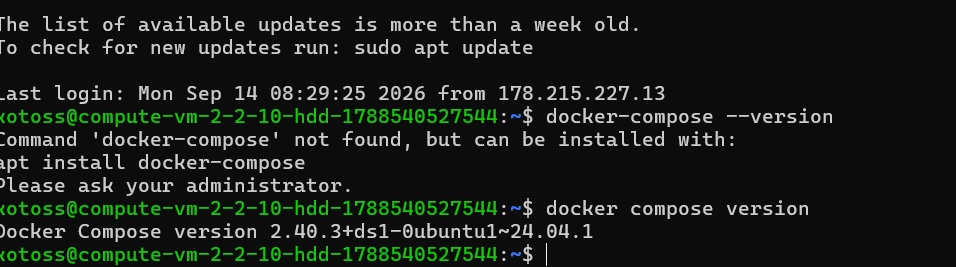
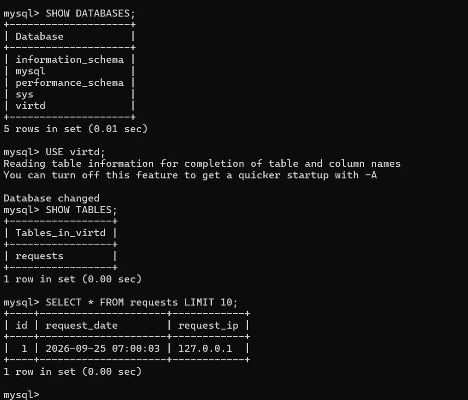
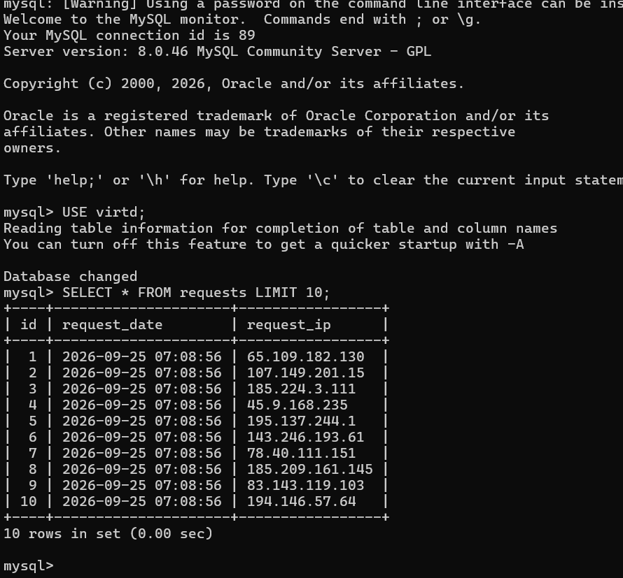
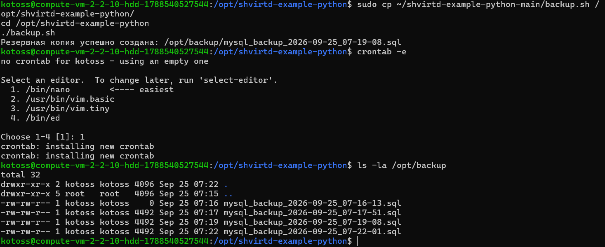
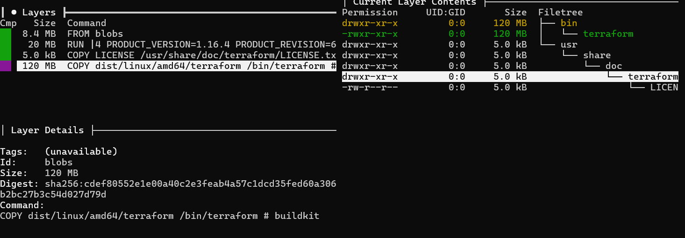

# Домашнее задание к занятию 5. «Практическое применение Docker» — Часть 2

## Задача 0
* Старый `docker-compose` отсутствует, плагин `docker compose` установлен (версия **2.40.3**).

## Задача 1
Создан многоэтапный `Dockerfile.python` на базе `python:3.12-slim`. Сборка и тегирование (`test-python-app:latest`) прошли успешно.

## Задача 2
Создан реестр `test`, образ отправлен в реестр и просканирован на уязвимости (найдено: high:44, medium:53, low:57).

## Задача 3
Работа проверена через `curl`, логи записаны в MySQL.

## Задача 4
Написан bash-скрипт `deploy.sh`, проект развернут в `/opt/shvirtd-example-python`.

## Задача 5
Написан скрипт `backup.sh` с использованием `schnitzler/mysqldump` и динамической загрузкой секретов из `.env`. Настроен cron-task.

## Задача 6
Слои проанализированы через `dive`, файл скопирован на локальную машину. Полные данные и логи можно найти в исходных материалах.

