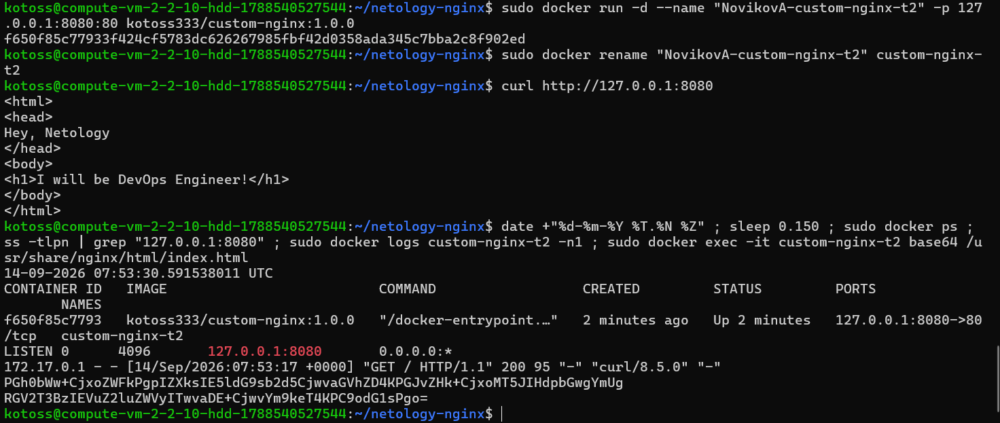
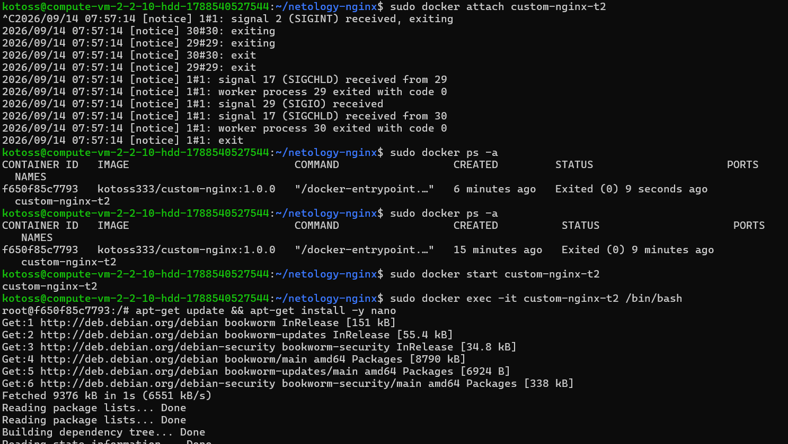
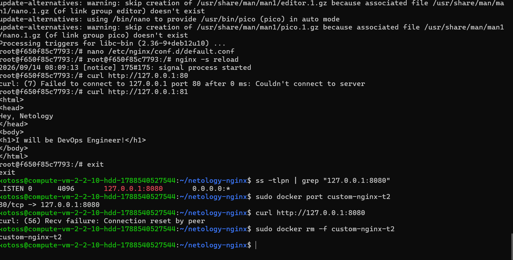
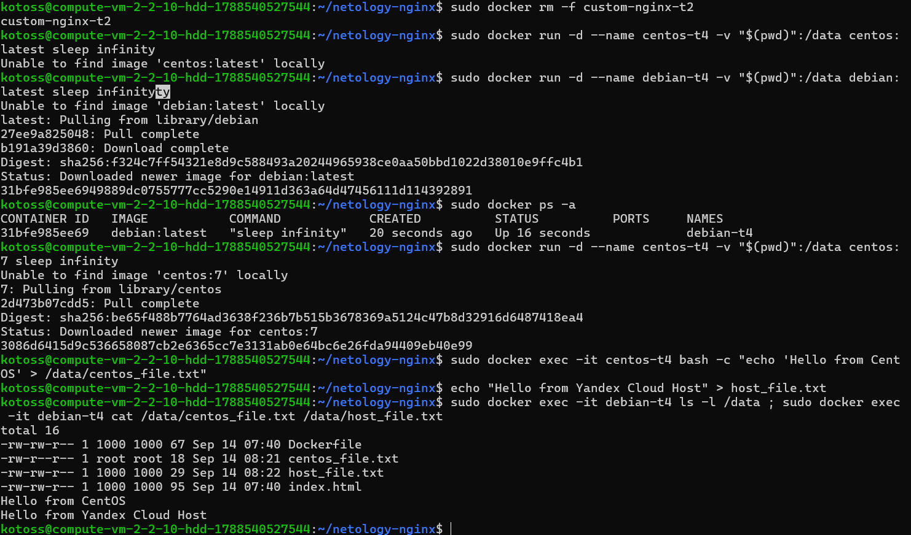
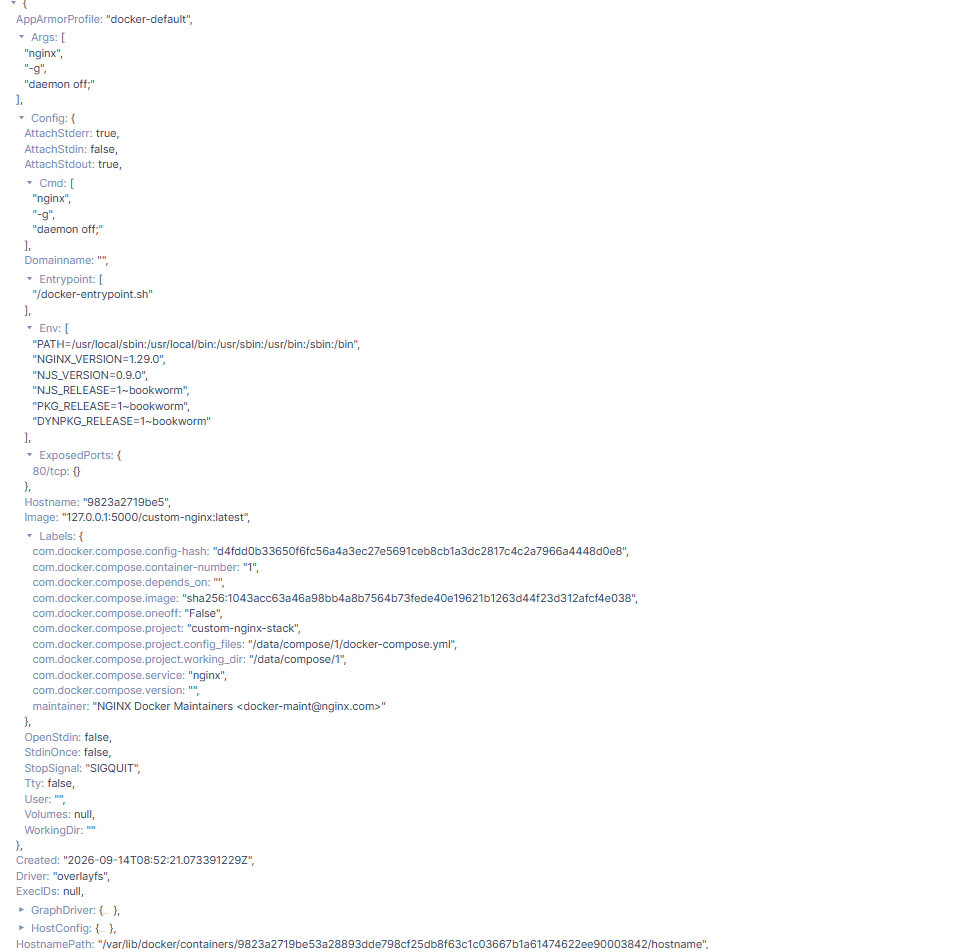
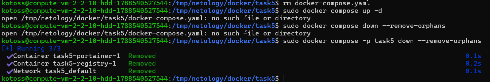

# Домашнее задание к занятию 4 «Оркестрация группой Docker контейнеров на примере Docker Compose»

## Задача 1. Создание и публикация собственного образа

https://hub.docker.com/repository/docker/kotoss333/custom-nginx/general

---

## Задача 2. Запуск контейнера, переименование и верификация



---

## Задача 3. Анатомия контейнеров, работа с портами и потоками

### 1. Остановка контейнера через `docker attach`

**Объяснение:**
Контейнер остановился, потому что внутри него Nginx запущен как **PID 1** (главный и единственный основной процесс). Команда `docker attach` подключает наш терминал напрямую к стандартным потокам ввода/вывода этого процесса. Когда мы нажали `Ctrl+C`, мы отправили сигнал прерывания (`SIGINT`) главному процессу Nginx. Так как главный процесс завершил свою работу, Docker автоматически остановил и сам контейнер, ведь контейнер живет только до тех пор, пока активен его PID 1.



### 2. Изменение порта внутри контейнера и суть проблемы

**Объяснение сути возникшей проблемы:**
Суть проблемы в рассинхронизации настроек сети Docker и конфигурации Nginx. При старте контейнера Docker настроил проброс внешнего порта `8080` хоста на внутренний порт `80` контейнера. Так как мы вручную изменили порт Nginx внутри контейнера на `81`, внешний трафик через порт `8080` продолжает уходить на порт `80` контейнера, где его теперь никто не слушает.



---

## Задача 4. Разделяемые диски и Docker Volumes

В ходе выполнения задачи общая рабочая директория хост-машины `$(pwd)` была одновременно примонтирована в каталог `/data` двух независимых контейнеров (`centos:7` и `debian:latest`).

* В контейнере `centos-t4` был создан файл `centos_file.txt`.
* На хост-машине был создан файл `host_file.txt`.

С помощью интерактивной проверки из контейнера `debian-t4` было подтверждено, что оба файла успешно синхронизировались и доступны для чтения внутри изолированных контейнеров:



---

## Задача 5. Фиксация Docker Compose, локального Registry и Portainer

### 1. Приоритет запуска файлов
При выполнении команды `docker compose up -d` автоматически запускается файл **`compose.yaml`**. Согласно спецификации Docker Compose Application Model, данный файл имеет наивысший канонический приоритет. Файл `docker-compose.yaml` полностью игнорируется и оставлен движком только для обратной совместимости.

### 2. Финальный конфигурационный файл `compose.yaml`
```yaml
include:
  - docker-compose.yaml

services:
  portainer:
    network_mode: host
    image: portainer/portainer-ce:latest
    volumes:
      - /var/run/docker.sock:/var/run/docker.sock
```

### 3. Инспектирование контейнера Nginx в Portainer
Дерево параметров блока `Config` (от `AppArmorProfile` до `Driver`):



### 4. Суть предупреждения Warning и закрытие проекта одной командой
При удалении файла `docker-compose.yaml` нарушается директива `include`. Docker Compose выдает предупреждение, так как запущенный ранее контейнер локального реестра (`registry`) теряет свое описание в манифесте проекта и переходит в статус «осиротевшего» (*orphan container*).

Полная остановка и очистка всего проекта со всеми зависимыми контейнерами выполнена строго одной командой `sudo docker compose -p task5 down --remove-orphans`:

